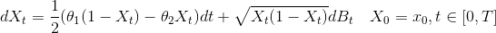
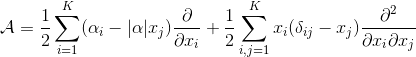
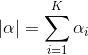

# ExactWrightFisher
Exact simulation of the neutral Wright-Fisher diffusion

Implementation of the exact simulation scheme of Jenkins, P. A., Spano, D., & Others. (2017). Exact simulation of the Wright--Fisher diffusion. The Annals of Applied Probability, 27(3), 1478–1509.

We consider a continuous time version of the multi-dimensional [Wright-Fisher model](https://en.wikipedia.org/wiki/Genetic_drift), which is a stochastic differential equation.

The 1-dimensional version of the Wright-Fisher model is defined by the following equation:

The multi-dimensional version is more easily expressed with the generator of the stochastic process:

where .

The scheme uses a retrospective approach similar to the *exact algorithms* of Beskos (2005), and employs the *alternating series trick* by Devroye to sample from an infinite series expansion of the transition function for the Wright-Fisher process.

This scheme may become inefficient for very short time steps, but a good approximation may then be used.

References:

- Beskos, A. and Roberts, G. O. (2005). Exact simulation of diffusions. The Annals of Applied Probability 15, 2422–2444.  
- Devroye, L. (1986). Nonuniform Random Variate Generation. Springer, New York.
- Jenkins, P. A., Spano, D., & Others. (2017). Exact simulation of the Wright--Fisher diffusion. The Annals of Applied Probability, 27(3), 1478–1509.
